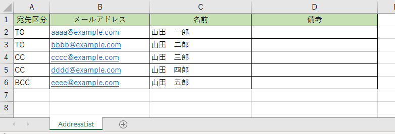
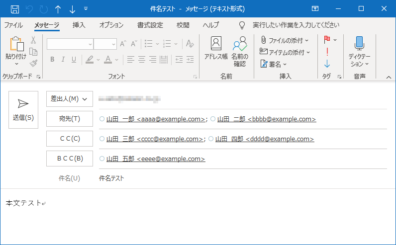

# 概要
Excelファイルを読み取り、メール送信アクティビティに渡せるように、宛先の文字列を作成します。
実施するのは宛先の作成のみで、メール送信は実施しません。

# 導入方法
ライブラリとしてプロジェクトを作成してあります。当リポジトリをクローンした後、UiPathでプロジェクトを開き、ライブラリとしてパブリッシュすることができます。  
もしくは、xamlファイルは1つだけなので、`ReadMailAddress.xaml`をコピーし、任意のプロジェクトへ貼りつけて使用することもできます。

# 引数
|名前|IN/OUT|説明|
|---|---|---|
|in_excelPath|IN|読み取るExcelファイルのパス|
|out_to|OUT|メール送信先(TO)|
|out_Cc|OUT|メール送信先(CC)|
|out_Bcc|OUT|メール送信先(BCC)|

# 読取Excelファイル

シート名：`AddressList`  
テーブルの開始位置：`A1`

## 列定義
|列名|説明|
|---|---|
|宛先区分|TO/CC/BCCのいずれかを指定する。空白の場合は無視する。|
|メールアドレス|メールアドレスを指定する。空白の場合は無視する。|
|名前|宛先欄に表示したい名前を指定する。空白可。|
|備考|参考情報を書く場所。プログラムでは使用しない。|

# 実行サンプル
↓上記Excelのサンプル画像を元に、メール送信を実行した結果(実際には送信せず下書き保存している)。  

